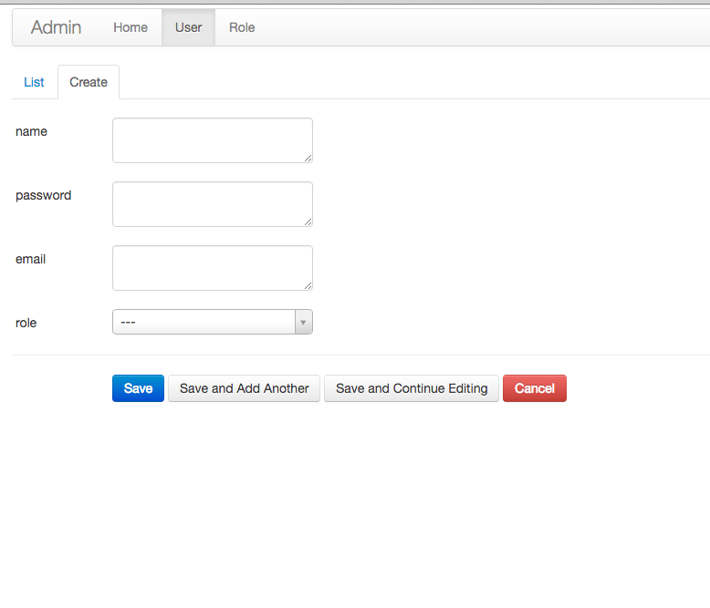

# 编写 TODO 应用【part002】

## 设置配置

配置的话，我们全放在 config 目录下，并且按环境划分，因为只使用到开发环境，所以就只设置了开发环境的：

config/__init__.py

		# coding: UTF-8
		import os
		
		
		def load_config(mode=os.environ.get('MODE')):
		    """Load config."""
		    try:
		        if mode == 'PRODUCTION':
		            from .production import ProductionConfig
		            return ProductionConfig
		        elif mode == 'TESTING':
		            from .testing import TestingConfig
		            return TestingConfig
		        else:
		            from .development import DevelopmentConfig
		            return DevelopmentConfig
		    except ImportError:
		        from .default import Config
		        return Config
	
	config/development.py
	
		# coding: utf-8
		import os
		
		
		class DevelopmentConfig(object):
		    """Base config class."""
		    # Flask app config
		    DEBUG = False
		    TESTING = False
		    SECRET_KEY = "sample_key"
		
		    # Root path of project
		    PROJECT_PATH = os.path.abspath(os.path.join(os.path.dirname(__file__), '..'))
		
		    # Site domain
		    SITE_TITLE = "twtf"
		    SITE_DOMAIN = "http://localhost:8080"
		
		    # MongoEngine config
		    MONGODB_SETTINGS = {
		        'db': 'the_way_to_flask',
		        'host': '192.168.59.103',
		        'port': 27017
		    }
	
	## 配置运行脚本
	
	到此，我们的应用代码算是写完了，然后就是运行服务器了，还是使用 Flask-Script，所以我们需要配置 manage.py，内容为；
	
	manage.py
	
	#!/usr/bin/env python
	# encoding: utf-8
	from flask_script import Manager
	from flask_script.commands import ShowUrls
	
	from application import create_app
	
	manager = Manager(create_app)
	manager.add_option('-c', '--config', dest='mode', required=False)
	
	manager.add_command("showurls", ShowUrls())	
	
	if __name__ == "__main__":
	    manager.run()

## 运行服务器

	pyhton manage.py -c development runserver

当你看到以下语句的时候说明你的服务器运行成功了：

	* Running on http://127.0.0.1:5000/ (Press CTRL+C to quit)

## 添加用户

因为现在数据库中是没有用户的，所以我们需要手动添加一个用户先，在管理后台可以添加：

	http://localhost:5000/admin/user/
	

	
## 测试功能：

登录：

	POST /auth/login HTTP/1.1
	Host: localhost:5000

	{"username": "zhangsan",
	 "password": "password"}
 
响应应该是：

	{
	  "email": "zhangsan@gmail.com",
	  "name": "zhangsan",
	  "role": "ADMIN"
	} 

