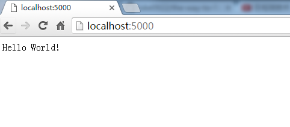

# 简单的 Flask 应用

作为本书的第一个示例，也可能是你接触的第一个 Flask 应用，我还是以程序届常规的 Hello World 为例来编写一个非常简单的例子。

这个例子的功能就是你在浏览器中输入URL：

	http://localhost:5000
	
然后，你就可以在浏览器中看到：

	Hello World！
	
## Simple Flask App

首先，我们先来看一个简短的代码

	#!/usr/bin/env python
	# encoding: utf-8
	from flask import Flask
	
	app = Flask(__name__)
	
	
	@app.route('/')
	def index():
	    return "Hello World!"
	
	app.run()

将这段代码保存为 `app.py`，然后再使用 python 运行这个文件：
	
	python app.py

回车之后，你将会看到类似以下的输出：

	* Running on http://127.0.0.1:5000/ (Press CTRL+C to quit)

如果有其它错误，你可以仔细看看是什么问题，代码和我上面是否一致，还有一个很重要的点就是，你是否已经安装了 Flask ，如果没有的话，那么安装一下：

	pip install Flask==0.10.1
安装完成后，继续使用 Python 运行上述文件：
	
	python app.py

然后在浏览器上打开以下URL：

	http://localhost:5000

你将会看到这个界面：

那就说明你的第一个 Flask 应用已经运行成功了。

## 简析第一个应用

对于你运行成功的第一个程序很简单，我们就做一些简单的分析，让你有一个简单的了解。

前两行的编码说明就不说了，这是 Python 的特性，而不是 Flask 特有的，如果读者有不懂的话，建议查看 Python 的文件编码说明。

然后继续看代码，我们的所有代码只有一个 `import`，就是 `Flask`，这是 Flask 这个框架的核心，我们把它认为是服务器就可以了，目前不需要多关注：

	from flask import Flask

然后接下去看，解析来一句是初始化了一个 Flask 变量，那么我们就可以认为是创建了一个服务器；需要注意的是这里传递了一个参数 __name__，我们知道在 Python 中 __name__ 这个变量是表示模块的名称，**这个参数对于 Flask 很重要，因为 Flask 会依赖于它去判断从哪里找模板、静态文件**。
	
	app = Flask(__name__)
	
接下来三句目前来说可能有点超出我们的讨论范围，但是我们这里稍微讲解一下好了，这三句中关键是第一句和第三句。

	@app.route('/')
	def index():
	    return "Hello World!"

第一句中关键的是 `'/'` 这个参数，这个参数的作用是说下面的这个函数对应于我们在浏览器中输入的地址：

	http://localhost:5000 + 后面的参数

这样说，大家可能不太明白，假设换成：

	@app.route('/hello')
	def hello():
		return "hello world"

的话，那么也就表示，我们在浏览器中访问：

	http://localhost:5000/hello

那么 Flask 就会调用到 hello 这个函数。 
	
那第三句的意思大家可能会比较容易理解了，没错，return 的内容就是我们在浏览器中看到的内容了。我们的代码中 return 的是 "Hello World！"，那么我们在浏览器中看到的就是 Hello World！

到目前为止，我们 import 了服务器（**import Flask**）,创建了服务器（***Flask(__name__)***），是时候将服务器运行起来了，是的，最后一句
	
	app.run()

就是表示将服务器运行起来，接受浏览器的访问。

那么整个过程就是这样的，当我们在浏览器中输入

	http://localhost:5000

的时候，其实浏览器默默得在我们的 URL 后面加入了一个 `/`，真实访问的就是 

	http://localhost:5000/

其实也就是对应着我们的
	
	app.route('/')

函数了，这个函数

	return "Hello World!"

所以我们在浏览器中就看到了：
	
	Hello World！
