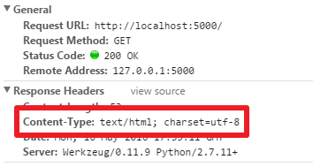
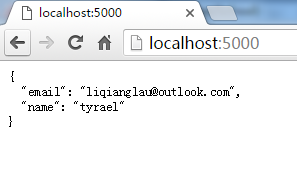
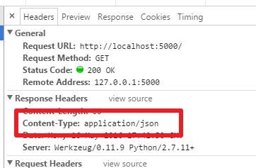

# 简单的 REST 服务

随着移动设备的不断发展，移动端的需求日益增大，对于大多数公司来说，可能用户量已超越 PC 端。而随着移动端发展，伴随而来的是对于客户端和服务器的交互越来越轻量化，相对 “笨重” 的 HTML 页面逐渐被移动端抛弃（但是 H5 的出现，这一情况有所转变），而此时 REST 服务模式被越来越多人接受。

通俗来说，REST 服务最少都需要提供查询功能，丰富一下的则会提供增删改查功能，其中还可能包含批量的操作。但是，本章因为是介绍如何使用 Flask 编写一个 REST 服务器的示例，所以本章要介绍的功能是：

- 使用 PUT、DELETE、POST和GET 进行数据增删改查
- 返回 json 结构的数据

## 修改第一个程序

我们回忆一下第一个程序，他的功能就是我们在浏览器中输入 URL

	http://localhost:5000

时，返回一个字符串 “Hello World！”，于是我们就想，我们能不能将这个字符串换成 json 序列？这样不就等于我们实现了 REST 的查询 API 了？

于是，我们可能第一冲动就会这么实现：

	#!/usr/bin/env python
	# encoding: utf-8
	import json
	from flask import Flask
	
	app = Flask(__name__)
	
	
	@app.route('/')
	def index():
	    return json.dumps({'name': 'tyrael',
	                       'email': 'liqianglau@outlook.com'})
	
	app.run()

其实我们就是修改了返回的字符串，将它修改成 JSON 的字符串，然后我们在浏览器上打开
	
	http://localhost:5000

看到的是：
	

哇！！好像是实现了我们想要的功能，返回了 JSON 字符串，但是我们打开 Chrome（我使用的是 Chrome，Safari 和 Firefox 同样有类似的工具）的调试工具（Windows下按： Ctrl + Alt + I，Mac 下按：Cmd + Shift + I），我们可以看到其实这个返回的数据类型居然是 html 类型：

你可能会奇怪这会有什么影响，这个影响大多数情况下应该不大，但是对于某些移动端的库，可能会根据这个响应头来处理数据，这个时候就悲剧了。

## 返回json

处理这个情况我们不能简单得想把这个响应头设置成 json 格式，这样修补 bug 是会导致其他 bug 的，譬如其他我们不知道的地方还有类似的坑。

更好的解决方案是使用 Flask 的 jsonify 函数，我这里使用这个函数修改一下代码：

	#!/usr/bin/env python
	# encoding: utf-8
	import json
	from flask import Flask, jsonify
	
	app = Flask(__name__)
	
	
	@app.route('/')
	def index():
	    return jsonify({'name': 'tyrael',
	                    'email': 'liqianglau@outlook.com'})
	
	app.run()

这里做了两处修改，分别是：

	from flask import ...., jsonify
	... ...
	return jsonify({'name': 'tyrael',
					'email': 'liqianglau@outlook.com'})

此时，我们再保存代码，运行代码，并且访问看看：

我们发现代码居然排好了版式，然后再看看响应头：

响应头也变成了 `application/json` 了。

好了，那么我们这里达到了第一个目的了，返回 json 数据。但是，我们的另外一个目的—使用 DEL，PUT和 POST 方法怎么处理？

## 请求方法

我们知道常用的 HTTP 请求方法有 6 种，分别是

- GET
- POST
- PUT
- DELETE
- PATCH
- HEAD

那么我们刚刚的代码只能默认得处理 GET 的情况（浏览器默认使用GET），那么其他情况怎么处理？

这时我们回到我们的代码中，既然我们的 **URL** 是通过 
	
	app.route('...')

来拼接的，那么，请求方法是不是也可以在这里指定？

事实上就是这样的，请求方法通过一个叫做 methods 的参数指定，例如下面分别对应 POST、DELETE、PUT 方法。

	@app.route('/', methods=['POST'])
	@app.route('/', methods=['DELETE'])
	@app.route('/', methods=['PUT'])

还有一个问题就是我们因为要做数据的增删改查，所以需要考虑数据的保存，因为数据库的操作在本章又是超出范围的讨论，所以这里我们简单得以文件作为保存数据的媒介。进行数据操作，那么我们的代码可以这么写：

	#!/usr/bin/env python
	# encoding: utf-8
	import json
	from flask import Flask, request, jsonify
	
	app = Flask(__name__)
	
	
	@app.route('/', methods=['GET'])
	def query_records():
	    name = request.args.get('name')
	    print name
	    with open('/tmp/data.txt', 'r') as f:
	        data = f.read()
	        records = json.loads(data)
	        for record in records:
	            if record['name'] == name:
	                return jsonify(record)
	        return jsonify({'error': 'data not found'})
	
	
	@app.route('/', methods=['PUT'])
	def create_record():
	    record = json.loads(request.data)
	    with open('/tmp/data.txt', 'r') as f:
	        data = f.read()
	
	    if not data:
	        records = [record]
	    else:
	        records = json.loads(data)
	        records.append(record)
	
	    with open('/tmp/data.txt', 'w') as f:
	        f.write(json.dumps(records, indent=2))
	    return jsonify(record)
	
	
	@app.route('/', methods=['POST'])
	def update_record():
	    record = json.loads(request.data)
	    new_records = []
	    with open('/tmp/data.txt', 'r') as f:
	        data = f.read()
	        records = json.loads(data)
	
	    for r in records:
	        if r['name'] == record['name']:
	            r['email'] = record['email']
	        new_records.append(r)
	
	    with open('/tmp/data.txt', 'w') as f:
	        f.write(json.dumps(new_records, indent=2))
	    return jsonify(record)
	
	
	@app.route('/', methods=['DELETE'])
	def delte_record():
	    record = json.loads(request.data)
	    new_records = []
	    with open('/tmp/data.txt', 'r') as f:
	        data = f.read()
	        records = json.loads(data)
	        for r in records:
	            if r['name'] == record['name']:
	                continue
	            new_records.append(r)
	
	    with open('/tmp/data.txt', 'w') as f:
	        f.write(json.dumps(new_records, indent=2))
	
	    return jsonify(record)
	
	app.run(debug=True)

这段代码虽然很长，但是代码都比较容易懂，而且都是比较简单的文件操作。

这段代码我们需要关注的点有以下几点：

- 如何设置请求方法

	@app.route('/', methods=['GET'])
	@app.route('/', methods=['PUT'])
	@app.route('/', methods=['POST'])
	@app.route('/', methods=['DELETE'])

- 如何获取数据

在 Flask 中有一个 request 变量，这是一个请求上下文的变量，然后里面包含多个属性是可以用来获取请求的参数的，例如我们这里用到了两种方式：

1. request.args.get('name')

	request.args 这个属性用于表示 GET 请求在 URL 上附带的参数

2. json.loads(request.data)

	request.data 这个属性用于表示 POST 等请求的请求体中的数据

我们目前对 request 变量就做这么多介绍吧，毕竟我们本章的目标是让大家了解如何处理 GET、POST、PUT 等不同的请求方式如何处理。